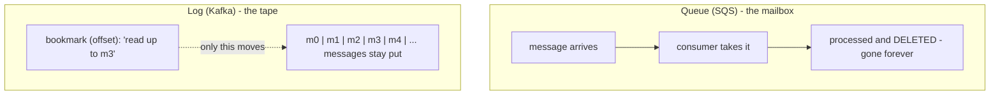
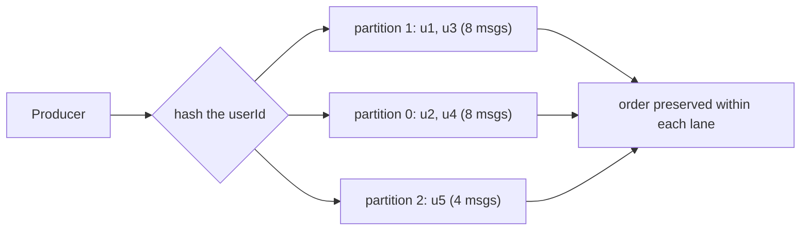
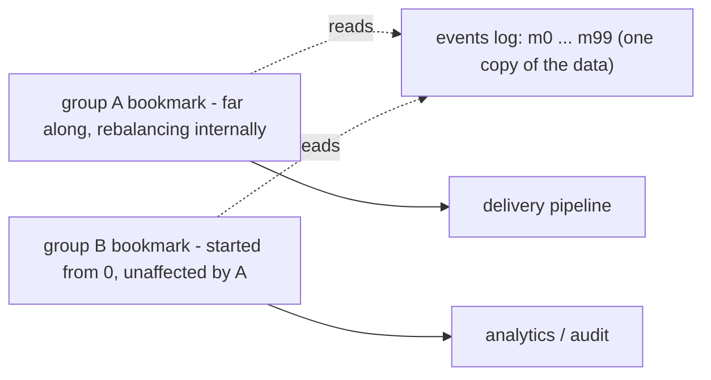
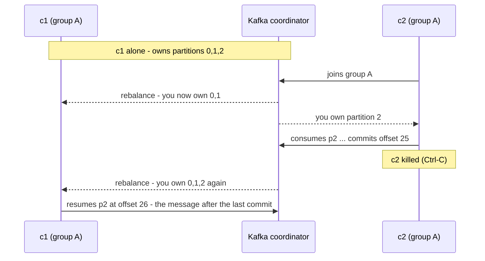
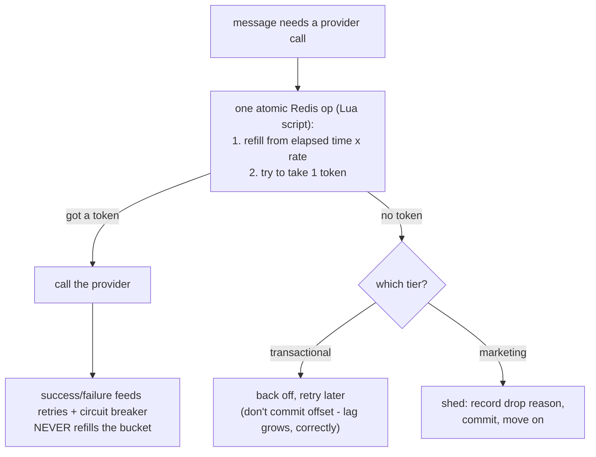

# Kafka Learnings — From Zero Hands-On to a Working Mental Model

*Companion doc to the kafka-consumer-producer demo (Docker Compose + kafkajs, July 2026). Written to be readable without much jargon. Every claim here was directly observed in the demo, not just read about.*

---

## The question that started it

**"Where do Kinesis and Flink come into the picture with message queues like Kafka or SQS?"**

The answer that unlocked everything: these four names sit on **two different axes**, not one.

- **SQS, Kafka, Kinesis** are *transport* — they move and hold messages.
- **Flink** is *compute* — it processes streams. It doesn't compete with Kafka; it reads *from* Kafka and computes things over what it reads.

And within transport there's a second split that turned out to be the heart of the whole session: **queue vs log**.

## Queue vs log — the mailbox and the tape

A **queue** (SQS) is a mailbox of work items. A consumer takes a message, processes it, acknowledges it — and it's *gone*. Deleted. If a second system also needs that data, tough: you'd have to make a physical copy for it up front. There's no going back to re-read anything, because there's nothing left to read.

A **log** (Kafka, Kinesis) is a tape. Messages are written to the end and *stay there* for a retention window, whether or not anyone has read them. Reading doesn't delete anything. Each reader just keeps a **bookmark** (Kafka calls it an *offset*) marking how far along the tape it has gotten. Want to re-read? Move your bookmark back. Want two independent systems reading the same data? Give each its own bookmark. The data never moves — only the bookmarks do.

Kinesis is essentially "AWS's managed tape" — same log idea as Kafka, less to operate, clunkier to scale, tighter AWS integration.

**Diagram 1 — Mailbox vs tape**

**Rule of thumb:** SQS when you need a task done once and never re-read. Kafka/Kinesis when you need replay, ordering, or multiple independent readers.

---

## The five things observed by hand

The demo was one topic ("events") split into 3 partitions, a producer sending messages keyed by userId, and consumers joined into named groups. Five experiments, each showing one behavior.

### 1. Same key → same partition, every time

A partition is one lane of the tape. Kafka picks the lane by hashing the message's key. What the run showed: u1 landed on partition 1 *every single time*, u2 on partition 0 every time, and so on. The mapping isn't predictable in advance (it's a hash), but it is **stable** — and stability is the point. Because each partition preserves order, "same user always goes to the same lane" means **one user's messages can never overtake each other**. That's how a notification system guarantees "order shipped" arrives before "order delivered" for the same person, without needing any global ordering across all users.

**Diagram 2 — The mapping observed in the demo (stable, but lumpy)**

Also observed: 5 users over 3 partitions spread unevenly (8/8/4 messages). Hashing *distributes* keys; it doesn't *balance* them. With millions of real users this evens out; with five it lumps.

### 2. Replay — the thing SQS cannot do

Stopped the consumer, ran one command to move group A's bookmark back to zero, restarted the consumer — and all the messages came out again. Nothing had been re-sent. They were on the tape the whole time; consuming them never deleted anything. The "offset reset" just edited a number the broker stores.

Why SQS can't do this: in SQS, processing deletes the message. There's no tape to rewind and no bookmark to move — the data itself is gone. In Kafka, "how far group A has read" is server-side state, separate from the data. This one property is what makes "replay traffic after a bad deploy" possible in production.

One subtlety the delivery order revealed: on a cold start against a big backlog, the consumer drains one partition's batch, then the next — so output comes out grouped by partition. When consuming live at a slow trickle, it looks interleaved. **Only within-partition order is guaranteed. The weave across partitions is an artifact of fetching, never something to design against.**

### 3. Fan-out — many readers, one tape, zero copies

Started a consumer in a *new* group (B) while group A existed. Group B read everything from the beginning, completely ignoring how far group A had gotten. Two bookmarks, one tape. Later, group A went through a whole rebalancing drama (consumers joining, dying, partitions moving) and group B never noticed.

**Diagram 3 — One tape, independent bookmarks**

This is how one stream feeds a delivery pipeline, an analytics job, and an audit sink simultaneously without interference. In SQS-world you'd need SNS to physically copy every message into three queues. In Kafka it's just three bookmarks.

### 4. Rebalance — partitions move between consumers, work hands off cleanly

With one consumer in group A, it owned all 3 partitions. When a second consumer joined the *same* group, Kafka rebalanced: one took partitions 0 and 1, the other took partition 2. Work split, not duplicated — within one group, each message is processed once.

Then the interesting part: killing the consumer that owned partition 2. The survivor detected the rebalance and took partition 2 over — resuming from **exactly the next message after the dead consumer's last committed position**. No gap, no re-read. A worker died mid-stream and the work handed off at the bookmark.

**Diagram 4 — The rebalance arc, exactly as it ran**

The caveat that matters: this was clean because the dead consumer had *committed* its progress (Kafka auto-commits every few seconds by default). Die inside that window and the survivor resumes from the last commit — re-processing a few messages. That's "at-least-once" delivery in practice, and it's exactly why real pipelines put an idempotency guard (a "have I already sent this?" check) before side effects like sending an SMS.

### 5. Lag — the number that tells you you're falling behind

Lag = how far a group's bookmark trails the end of the tape, in messages. Produced 1,000 messages in ~2 seconds at a consumer deliberately slowed to ~1 message/second: lag shot to 999 and drained at a crawl. Added a fast consumer to the group: it instantly cleared the two partitions it was assigned — but the slow consumer's partition kept lagging, because **a partition can only go as fast as the one consumer that owns it**. Killed the slow consumer; the fast one took everything and lag hit 0.

Two production truths in that one run:

- **Partition count caps parallelism.** Three partitions means at most three consumers do useful work. A fourth idles. You size partitions up front for the parallelism you'll ever need.
- **Lag is the leading indicator.** Growing lag means arrival rate exceeds processing rate — the earliest, cheapest signal that consumers are under-provisioned or a downstream is slow. In a notification service, "lag on the transactional topic" is the single most important graph in the system.

The artificial `sleep` in the slow consumer wasn't a toy: it stood in for what real consumers do per message — a database write, an API call to a payment provider, a template render. Synchronous downstream work slower than the arrival rate is *the* most common real cause of lag.

---

## Questions that came up along the way

### Why do topic-creation and offset-reset shell into the Kafka container, while producing/consuming use Node?

Because they're different planes. Creating a topic and rewinding a bookmark are **admin-plane** operations — rare, one-shot, operational — and Kafka ships ready-made CLI tools for them inside its own image. Producing and consuming are the **data-plane** — the runtime behavior the demo exists to teach — so they use a real client library, where partition assignment, group joins, and rebalances become visible. (Programmatic admin clients exist for when topic creation needs to be automated; a learning harness doesn't need that.)

### How many partitions and topics can Kafka have? What drives it?

There's no meaningful per-topic limit; the binding constraint is **total partitions across the whole cluster**, because each one costs the brokers file handles, memory, and coordination bookkeeping. Old ZooKeeper-era guidance was ~200K partitions per cluster; modern KRaft-mode Kafka (what the demo ran) raised that by an order of magnitude.

What actually drives the per-topic number, in order:
1. **Consumer parallelism** — partitions cap useful consumers, so size for peak parallelism (seen directly in experiment 5).
2. **Throughput** — each partition has a ceiling rate; total need ÷ per-partition ceiling sets a floor.
3. **Key spread** — enough distinct keys to avoid hot partitions.

Against all three: more partitions = slower rebalances and failovers. Roughly: `partitions = max(throughput need, peak consumer count)`, plus headroom.

### Where does Kafka store messages? Does it use a database?

No database. Messages live in **plain append-only files on the broker's disk** — one set of files per partition, plus a small index mapping offset → position in the file. That's the entire storage engine, and it explains the observed behavior: replay works because the files are still there (consumption never deletes; a retention timer does), and an offset is literally a position on the tape. Kafka is fast *because* it refuses to be a database — appending to a file and reading it sequentially is the cheapest thing a disk does. No queries, no in-place updates, no secondary indexes, on purpose.

### Is the slow consumer a mini-Flink?

No — and the line between them is worth keeping sharp. The demo's consumer is a **plain consumer**: read a message, do some work, commit, move on. Each message handled independently. Adding a sleep, a database, or API calls doesn't change that — and real production consumers (a container with its own DB and third-party calls) are exactly this shape.

**Flink is defined by state that spans messages**: counting events per time window, correlating sequences, handling out-of-order arrivals correctly, and keeping that cross-message state crash-safe via checkpointing. That's genuinely hard, and it's what a Flink cluster is for. A plain consumer with a running total in a variable is not "basically Flink" — it loses the total on restart and has none of the correctness machinery. The trap to avoid: adding state to a consumer and accidentally hand-rolling a bad stream processor. If computation across messages over time is needed, that's the moment to reach for the real tool. A notification pipeline's delivery workers need none of that — they should stay plain consumers.

### "I can't just drop incoming requests — that's where Kafka helps." Right?

Half right, refined into something sharper: **never drop at ingestion; make deliberate drop decisions deeper in.** Kafka's buffer means the caller always gets an immediate "accepted" and spikes get absorbed instead of refused. But inside the pipeline, dropping is often *correct*: a user in quiet hours gets a deliberate, recorded drop; a marketing push that missed its relevance window during overload should be shed, not delivered at 2 a.m. three hours late. The buffer doesn't eliminate drop decisions — it buys the time to make them on your terms.

Also refined: what grows during a spike isn't only lag. End-to-end latency grows (new messages wait behind the backlog), and **downstream pressure** grows — more consumer throughput means more load on caches, databases, and third-party providers. Which leads to the last piece.

### Rate limiting consumers against a downstream limit (say a provider allows 100 requests/sec)

The shape: a **shared token bucket in Redis, one per provider**. Shared, because the 100/sec limit is global but there are N consumers — per-consumer local budgets waste capacity and break during rebalances. One bucket is the coordination point that lets independent consumers collectively hold one line.

Flow, with the two corrections that came out of discussing it:

- **Before** each provider call, the consumer atomically checks-and-takes a token (a single Redis Lua script, so N consumers can't race each other).
- **Refill is time-based, not completion-based.** The bucket refills at the configured rate (100/sec) purely from the passage of time — computed lazily *inside* the same atomic check ("how much time passed since last refill × rate"), so no background refiller process exists. The consumer does **not** put tokens back after a call, successful or not. This was the gap in the original sketch: refilling on success would mean a provider outage stops the refill and the system throttles itself to zero exactly when it shouldn't. Rate limiting and success/failure are separate concerns.
- **If no token:** the answer is a business decision per tier. Transactional → wait with backoff and retry (don't commit the offset; lag grows, which is correct — you can't go faster than the provider allows, and adding consumers won't help because the bucket, not the consumer count, is the governor). Marketing → shed it, record why, move on. Never spin-retry without backoff — that hammers Redis precisely when the system is already constrained.
**Diagram 5 — Token check per provider call (the deny path is a business decision)**

- **The bucket only handles the predictable half.** It enforces the limit *you configured*. The provider's real, current capacity can differ — it can degrade, or throttle harder than published. Reacting to actual 429/5xx responses is the circuit breaker's job. Bookmark: **bucket for the configured limit, breaker for reality.** Two mechanisms, together.

---

## What was actually learned (right-sized)

Went from "worked a bit with SQS, never touched Kafka" to having directly observed and explained the five dynamics that make a log different from a queue: stable key→partition mapping and per-partition ordering, offsets as movable server-side bookmarks, replay, independent consumer groups, rebalance with clean handoff at the committed boundary, and lag build/drain with parallelism capped by partition count.

The honest boundary: all of it on a single-broker local setup with replication factor 1. Replication, multi-broker failover, and the operational reality of running Kafka in production remain unseen. The accurate claim is "I understand the log-vs-queue model and can reason about it in a design conversation" — not "I know Kafka." That's exactly the claim the notification-service design needed backing for.

**Parked for later, deliberately:** Redis+Lua token-bucket mini-demo (two consumers holding a shared QPS line); exactly-once/transactions; multi-topic priority lanes; Flink hands-on. Each is its own tightly-scoped build with its own done-condition — not extensions of this one.
